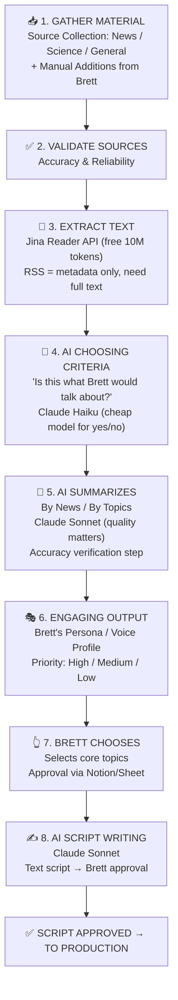
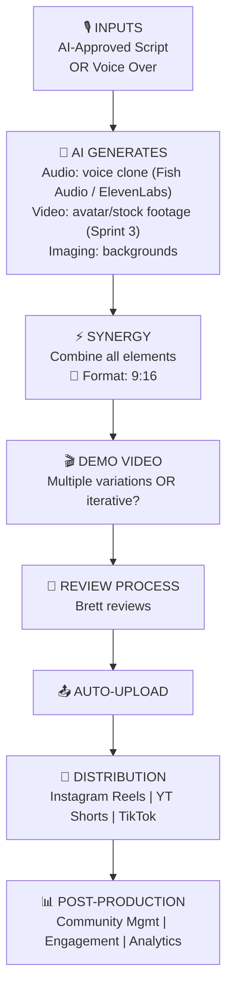

# Pipeline Design — Radical Concepts

Source: [Pipeline Workflow — Whiteboard Diagrams (Meeting #2)](https://www.notion.so/3124d347036281dd9a8ef8087432f63b)

## Content Pipeline (Sprint 1 Focus)

## Production Pipeline (Sprint 2+)

## n8n Implementation Plan (Sprint 1)

| Pipeline Step | Tool/Service | n8n Node |
|---|---|---|
| RSS Ingestion | RSS protocol | RSS Feed Trigger (built-in) |
| Full-Text Extraction | Jina Reader API | HTTP Request (`GET r.jina.ai/{url}`) |
| AI Filtering | Claude Haiku / GPT-4o-mini | Anthropic/OpenAI node |
| AI Summarization | Claude Sonnet / GPT-4o | Anthropic/OpenAI node |
| Persona Transform | Claude Sonnet / GPT-4o | Anthropic/OpenAI node |
| Brett Approval | Notion or Google Sheet | Webhook / manual trigger |
| Script Generation | Claude Sonnet / GPT-4o | Anthropic/OpenAI node |

## Open Questions

- [ ] Can RSS access paid sources (FT, NYT)? → Check ESADE library Factiva/LexisNexis API
- [ ] Is AI reliable for topic selection? Hallucination risk?
- [ ] What if it's quiet and no news on a topic?
- [ ] Multiple video variations upfront OR iterative feedback loop?
- [ ] Brett records vs AI voice for each content stream?
- [ ] Copyright implications of summarizing paywalled articles for podcast?
