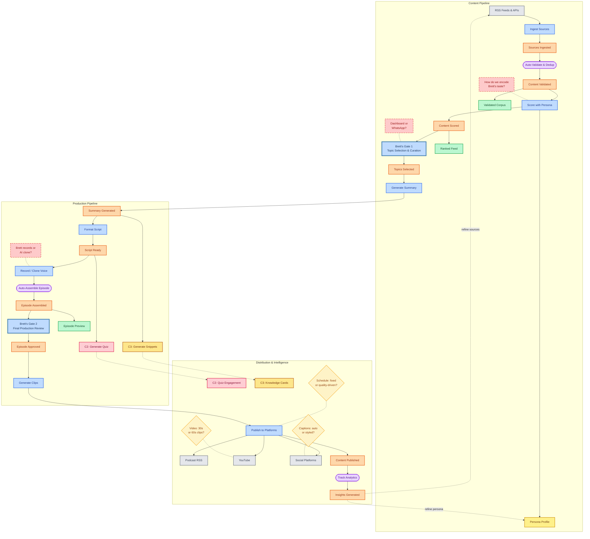

# Radical Concepts -- Event Storming Flow

Full architecture flow from source to audience. Domain-Driven Design notation with every event, command, policy, and decision point across three pipeline lanes.

## Node Type Legend

| Type | Color | Description |
|------|-------|-------------|
| **Domain Event** | Orange | Something that happened in the system |
| **Command** | Blue | An action triggered by a user or policy |
| **Read Model** | Green | A queryable view or projection of data |
| **Policy** | Purple | Automated rule or process (no human input) |
| **Aggregate** | Yellow | Domain entity cluster that enforces invariants |
| **Hotspot** | Red (dashed) | Open question, risk, or unresolved decision |
| **External System** | Grey | System outside the domain boundary |
| **Human Gate** | Steel Blue (thick) | Brett's manual approval checkpoint |
| **Decision** | Amber (diamond) | Open architectural or product decision |
| **C2 Branch** | Coral | Curiosity Game expansion path (future) |
| **C3 Branch** | Gold | Dinner Table Drop expansion path (future) |
